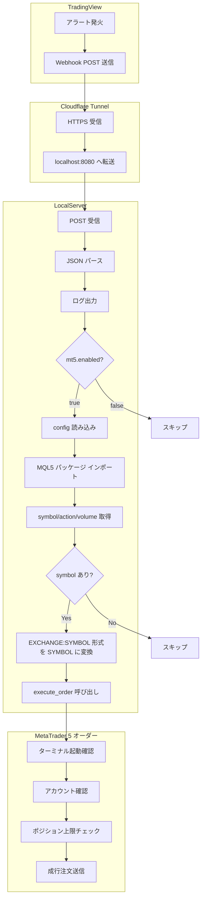

# SMCSE

TradingView のシグナルアラートを Webhook で受信し、ローカルで処理するシステム。

## 構成

```
TradingView アラート
    ↓ Webhook (POST)
https://your-hostname.com (Cloudflare Tunnel)
    ↓
LocalServer (Python) ← localhost:8080
```

---

## 処理フロー



### フロー説明

| ステップ | 説明 |
|----------|------|
| 1. TradingView | アラート条件が満たされると、設定した Webhook URL へ POST 送信 |
| 2. Cloudflare Tunnel | HTTPS で受信し、localhost:8080 へ転送 |
| 3. LocalServer | POST ボディを JSON としてパースし、ログに記録 |
| 4. ジョブ判定 | `config.webhook.job` が `mt5_order` の場合のみ MetaTrader 5 注文処理へ（`log_only` の場合はログのみ） |
| 5. 接続判定 | `config.mt5.enabled` が `true` の場合のみ注文処理へ |
| 6. パラメータ取得 | ペイロードから symbol, action, volume を取得（不足時は config で補完） |
| 7. 注文送信 | ターミナル起動確認 → アカウント確認 → ポジション上限チェック → 成行注文送信 |

---

## Webhook POST リファレンス

### エンドポイント

| メソッド | URL | 説明 |
|----------|-----|------|
| POST | `https://your-hostname.com` | Webhook 受信・MetaTrader 5 注文実行 |
| GET | `https://your-hostname.com` | ヘルスチェック（`{"message":"Webhook server is running"}` を返す） |

### リクエスト形式

- **Content-Type**: `application/json`（推奨）
- **Body**: JSON 形式

### ペイロード項目（MetaTrader 5 注文用）

| 項目 | 型 | 必須 | 説明 | フォールバック |
|------|-----|------|------|----------------|
| `symbol` | string | ○* | 通貨ペア（例: BTCUSD, USDJPY） | `symbol_name`, `ticker`, `config.mt5.symbol` |
| `action` | string | ○* | 注文方向 | `trade`, `order`, `side`, `"buy"` |
| `volume` | number | - | ロット数 | `quantity`, `config.mt5.volume` (0.01) |

\* symbol はペイロードまたは config のいずれかで必須。action は未指定時 `"buy"`。

### シンボル形式

- `BINANCE:BTCUSD` のように `EXCHANGE:SYMBOL` 形式の場合は、`SYMBOL` 部分のみ使用（例: `BTCUSD`）

### ペイロード例

**最小構成（symbol と action）**

```json
{"symbol": "BTCUSD", "action": "buy"}
```

**TradingView 形式（{{ticker}} が BINANCE:BTCUSD 等に置換される）**

```json
{"symbol": "{{ticker}}", "action": "buy"}
```

**フル指定**

```json
{"symbol": "USDJPY", "action": "sell", "volume": 0.01}
```

### レスポンス

**成功時（200 OK）**

```json
{"status": "ok", "received": { ... 受信したペイロード ... }}
```

### 代替キー名

ペイロードでは以下のキー名も認識されます（優先順）:

- **symbol**: `symbol` → `symbol_name` → `ticker`
- **action**: `action` → `trade` → `order` → `side`
- **volume**: `volume` → `quantity`

また、`message` や `raw` が JSON 文字列の場合、その内容をパースしてマージします。

---

## 前提条件

- Python 3.8+
- Cloudflare アカウント
- ドメイン（Cloudflare に追加済み、ネームサーバー設定済み）

---

## 1. 設定ファイルの準備

### config.json の作成

`config/config.json` は Git に含まれません。テンプレートから作成してください。

```powershell
copy config\config.json.example config\config.json
```

### 設定項目

#### server（LocalServer）

| 項目 | 型 | 説明 |
|------|-----|------|
| `server.host` | string | バインドするホスト。全インターフェースで受信する場合は `0.0.0.0` |
| `server.port` | number | LocalServer のポート番号（デフォルト: 8080） |

#### webhook（Webhook 処理）

| 項目 | 型 | 説明 |
|------|-----|------|
| `webhook.job` | string | 受信後の処理ジョブ。`mt5_order`: MetaTrader 5 への成行注文実行 / `log_only`: ログ出力のみ |

#### tunnel（Cloudflare Tunnel）

| 項目 | 型 | 説明 |
|------|-----|------|
| `tunnel.token` | string | Cloudflare コネクタトークン。トンネル作成時にダッシュボードで取得 |
| `tunnel.hostname` | string | 公開するホスト名（例: `smcse.example.com`）。Ingress の Public Hostname に対応 |
| `tunnel.api_token` | string | Cloudflare API トークン。Ingress の起動時自動更新に使用。権限: Account - Cloudflare Tunnel - Edit |

#### mt5（MetaTrader 5）

| 項目 | 型 | 説明 |
|------|-----|------|
| `mt5.enabled` | boolean | MetaTrader 5 への注文を有効にする。`false` の場合は Webhook 受信時も注文しない |
| `mt5.volume` | number | デフォルトロット数。Webhook に volume が含まれない場合に使用（例: 0.01） |
| `mt5.magic` | number | EA ID（マジック番号）。注文・ポジションの識別用。他 EA と重複しない値にする |
| `mt5.comment` | string | 注文コメント。ターミナルでは 31 文字まで |
| `mt5.terminal_path` | string | MetaTrader 5 ターミナルの実行ファイルパス。空の場合は自動検出 |
| `mt5.symbol` | string | 対象シンボル（例: USDJPY, BTCUSD）。ペイロードに symbol がない場合のデフォルト |
| `mt5.position_limit` | number | 同一シンボルあたりのポジション上限。この件数に達すると新規オーダーを拒否。`0` の場合はチェックしない |
| `mt5.account_login` | number | 想定するアカウント番号。一致しないアカウントでログイン中はオーダーを拒否。`0` の場合はチェックしない |

### トークンの取得

**コネクタトークン（tunnel.token）**

1. [Cloudflare ダッシュボード](https://dash.cloudflare.com/) → Zero Trust または Networks → Tunnels
2. トンネルを作成
3. インストールコマンドに表示されるトークンをコピー

**API トークン（tunnel.api_token）**

1. Cloudflare ダッシュボード → マイプロファイル → API トークン
2. カスタムトークンを作成
3. 権限: **Account** - **Cloudflare Tunnel** - **Edit**
4. トークンをコピー

---

## 2. LocalServer のセットアップ

Webhook を受信する Python サーバー。

### 起動

```powershell
cd LocalServer
python main.py
```

### ログ

受信データは `LocalServer/logs/webhook.log` に記録されます。

### MetaTrader 5 注文（オプション・MQL5 パッケージ）

Webhook で受信したシグナルを MetaTrader 5 に成行注文で送信できます。Python モジュールはリポジトリ直下の `MQL5/` にあります（`extras/MQL5/` の `.mq5` ソースとは別）。

**前提条件**

- MetaTrader 5 ターミナルが起動していること
- `pip install -r MQL5/requirements.txt` でパッケージをインストール
- `config.json` の `mt5.enabled` を `true` に設定

詳細は [Webhook POST リファレンス](#webhook-post-リファレンス) を参照。

---

## 3. Cloudflare Tunnel のセットアップ

### cloudflared のインストール（tunnel 配下）

```powershell
cd tunnel
python install_cloudflared.py
```

### 起動

```powershell
cd tunnel
python main.py
```

### Cloudflare ダッシュボードでの設定

1. **Public Hostname（Ingress）**
   - ダッシュボードで設定するか、`config.json` の `tunnel.api_token` を設定すると起動時に自動更新
   - ホスト名: `your-subdomain.yourdomain.com`
   - サービス: `http://localhost:8080`

2. **DNS レコード**
   - タイプ: CNAME
   - 名前: `your-subdomain`（またはホスト名のサブドメイン部分）
   - ターゲット: `{トンネルID}.cfargotunnel.com`
   - トンネル ID はダッシュボードの Tunnels で確認

---

## 4. TradingView の設定

### Pine Script の追加

1. TradingView でチャートを開く
2. 下部の「Pine エディター」を開く
3. `PineScripts/one_minute_alert.pine` の内容をコピー＆ペースト
4. 「チャートに追加」をクリック

### アラートの作成

1. チャート上で右クリック → 「アラートを追加」
2. 条件: 「1分毎アラート」
3. 通知: 「Webhook URL」を選択
4. URL: `https://your-subdomain.yourdomain.com`（config の `tunnel.hostname` に対応）
5. メッセージ: スクリプトのデフォルト（`{"symbol":"{{ticker}}","action":"buy"}`）を使用

---

## 5. 起動

### 一括起動（推奨）

```powershell
python smcse.py
```

Webhook と Tunnel を同時に起動します。Ctrl+C で終了。

### 個別起動

1. **LocalServer** を起動
   ```powershell
   cd LocalServer
   python main.py
   ```

2. **Tunnel** を起動（別ターミナルで）
   ```powershell
   cd tunnel
   python main.py
   ```

3. TradingView でアラートを有効化

---

## ディレクトリ構成

```
SMCSE/
├── smcse.py                  # 統合起動スクリプト（Webhook + Tunnel）
├── config/
│   ├── config.json.example   # 設定テンプレート
│   └── config.json           # 実際の設定（Git に含めない）
├── LocalServer/              # Webhook 受信サーバー
├── MQL5/                     # MetaTrader 5 連携（Python）。MQL5 ソースは extras/MQL5/
├── tunnel/                   # Cloudflare Tunnel
├── PineScripts/              # TradingView 用 Pine Script
└── README.md
```

---

## トラブルシューティング

### ポート 8080 が使用中

```powershell
netstat -ano | findstr :8080
taskkill /PID <PID> /F
```

### DNS が解決できない

- Cloudflare ダッシュボードで CNAME レコードを確認
- 反映に数分かかることがあります

### 外部から受信できない

- LocalServer と Tunnel の両方が起動しているか確認
- Cloudflare ダッシュボードでトンネルが Healthy か確認
- Ingress の Service が `http://localhost:8080` になっているか確認
